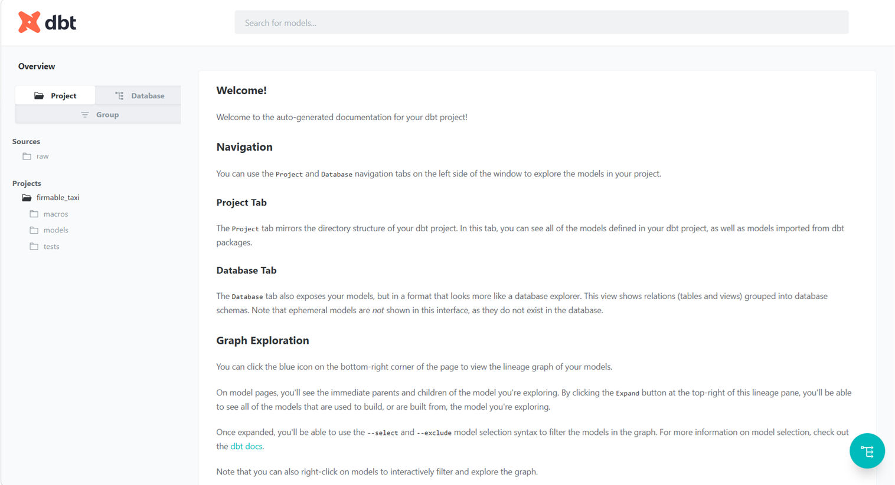
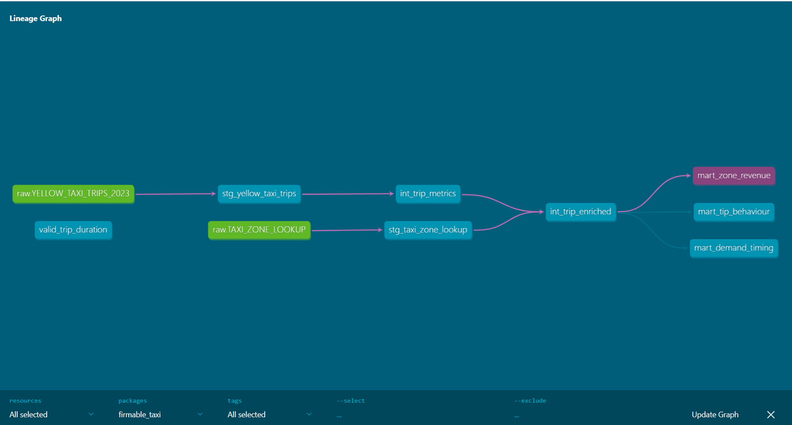
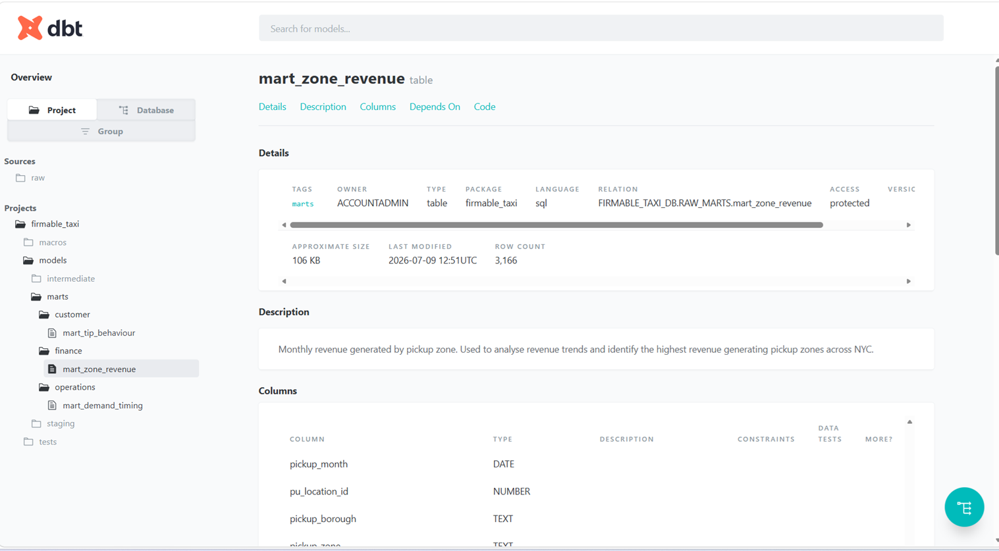

# NYC Taxi Data Engineering Platform

## Overview

This repository contains a production-style data engineering platform built for the Firmable Data Engineer technical assessment.

The solution ingests the 2023 NYC Yellow Taxi Trip dataset into Snowflake, transforms the data using dbt, orchestrates the end-to-end pipeline with Apache Airflow, and exposes analytics-ready data marts to answer business questions related to taxi demand, revenue, and tipping behaviour.

The project follows modern ELT principles with modular transformations, reusable components, automated data quality validation, and production-oriented engineering practices.

---

## Business Problem

The goal is to enable Firmable's Operations team to analyze NYC Yellow Taxi activity across 2023 by answering the following business questions:

- Which pickup zones generate the highest revenue throughout the year?
- How does demand vary by hour of the day?
- Which areas experience supply gaps?
- How does tip behaviour vary by payment type, distance, and pickup zone?

---

## Technology Stack

| Category | Technology |
|----------|------------|
| Programming Language | Python 3.12 |
| Data Warehouse | Snowflake |
| Data Transformation | dbt Core 1.11 |
| Workflow Orchestration | Apache Airflow |
| Version Control | Git & GitHub |
| File Format | Parquet |
| Cloud Storage | Snowflake Internal Stage |
| Configuration | python-dotenv |
| IDE | Cursor AI |
| AI Assistance | Cursor AI + ChatGPT |

---

# Solution Architecture

```
                            NYC TLC Parquet Files (2023)
                                        │
                                        ▼
                          Python Validation Framework
                                        │
                                        ▼
                         Snowflake Internal Stage (PUT)
                                        │
                                        ▼
                            COPY INTO Raw Snowflake Tables
                                        │
                                        ▼
                          dbt Staging Models (Data Cleaning)
                                        │
                                        ▼
                      dbt Intermediate Models (Business Logic)
                                        │
                                        ▼
                     dbt Mart Models (Analytics Ready Tables)
                                        │
                                        ▼
                         SQL Analytics & Business Reporting
                                        ▲
                                        │
                         Apache Airflow Orchestrates Pipeline
```

The pipeline follows an ELT architecture where raw data is first ingested into Snowflake before all business transformations are performed using dbt.

The workflow is orchestrated using Apache Airflow, ensuring that each stage executes only after successful completion of the previous stage. Data quality validation is implemented throughout the pipeline using both built-in dbt tests and a custom generic test.

---

# Project Structure

```
firmable-nyc-taxi-de/
│
├── config/
│   ├── settings.py
│   └── __init__.py
│
├── ingestion/
│   ├── validate_files.py
│   ├── load_to_snowflake.py
│   └── snowflake_client.py
│
├── dbt/
│   ├── models/
│   │   ├── staging/
│   │   ├── intermediate/
│   │   └── marts/
│   ├── macros/
│   ├── tests/
│   ├── dbt_project.yml
│   └── models/sources.yml
│
├── dags/
│   ├── taxi_pipeline_dag.py
│   ├── dbt_runner.py
│   └── airflow_requirements.txt
│
├── queries/
│   ├── 01_zone_revenue.sql
│   ├── 02_demand_timing.sql
│   └── 03_tip_behaviour.sql
│
├── docs/
├── requirements.txt
├── .gitignore
└── README.md
```

---

# End-to-End Pipeline

The pipeline executes in the following sequence:

1. Validate all required source files.
2. Upload Parquet and lookup data into Snowflake internal stages.
3. Load data into raw Snowflake tables using `COPY INTO`.
4. Execute dbt staging models.
5. Execute dbt intermediate models.
6. Build analytics-ready mart tables.
7. Execute dbt schema tests, custom generic tests, and source freshness checks.
8. Execute analytical SQL queries on the mart layer.

# Setup & Execution

## Prerequisites

Before running the project, ensure the following are installed:

- Python 3.12+
- Git
- Snowflake Account (Trial or Enterprise)
- dbt Core (Snowflake adapter)
- Apache Airflow (Linux/WSL/Docker recommended)
- Cursor AI or Visual Studio Code (optional)

---

## Clone the Repository

```bash
git clone https://github.com/jasmeetsinghsahani012-ops/firmable-nyc-taxi-data-platform.git
cd firmable-nyc-taxi-data-platform
```

---

## Install Python Dependencies

```bash
pip install -r requirements.txt
```

---

## Configure Environment Variables

Create a `.env` file in the project root.

Example:

```text
SNOWFLAKE_ACCOUNT=<account>
SNOWFLAKE_USER=<user>
SNOWFLAKE_PASSWORD=<password>
SNOWFLAKE_ROLE=ACCOUNTADMIN
SNOWFLAKE_DATABASE=FIRMABLE_TAXI_DB
SNOWFLAKE_SCHEMA=RAW
SNOWFLAKE_WAREHOUSE=FIRMABLE_TAXI_WH
```

---

## Validate Source Files

```bash
python -m ingestion.validate_files
```

---

## Load Data into Snowflake

```bash
python -m ingestion.load_to_snowflake
```

---

## Run dbt Models

```bash
cd dbt

dbt run
```

---

## Execute dbt Tests

```bash
dbt test
```

---

## Validate Source Freshness

```bash
dbt source freshness
```

---

## Airflow Execution

The Airflow DAG orchestrates the pipeline in the following order:

```
Validate Files
      ↓
Load Data into Snowflake
      ↓
dbt Run
      ↓
dbt Test
```

The DAG is scheduled to execute daily and is designed to stop immediately if any upstream task fails.

---

# Data Quality Strategy

Data quality was treated as a first-class concern throughout the pipeline. Instead of only checking for missing values, validations were chosen based on business relevance and the characteristics of the NYC TLC dataset.

## Standard dbt Tests

The following built-in dbt tests were implemented:

- Not Null validation on:
  - Vendor ID
  - Pickup Datetime
  - Dropoff Datetime
  - Pickup Location ID
  - Dropoff Location ID

- Unique validation on:
  - Taxi Zone Lookup Location ID

## Custom Generic Test

A reusable custom generic dbt test (`valid_trip_duration`) was implemented to validate that:

> Dropoff time must never occur before Pickup time.

During execution, **2,475 records** violated this rule.

Instead of failing the entire pipeline, this validation was configured with **warning severity**. Since the TLC dataset is a public dataset containing known data quality issues, surfacing these records as warnings provides visibility without unnecessarily blocking downstream analytical workloads.

## Source Freshness

dbt source freshness checks were configured using the `loaded_at` timestamp generated during ingestion.

Freshness Rules:

- Warning after 1 day
- Error after 2 days

This helps detect stale source data before downstream transformations begin.

---

# Architecture Decisions

Several design decisions were made to keep the project modular, scalable, and production-oriented.

### ELT Architecture

Raw data is first loaded into Snowflake before all transformations are performed using dbt.

Benefits:

- Raw data remains immutable.
- Business logic is version-controlled.
- Easier debugging and lineage.
- Better separation between ingestion and transformation.

### Layered dbt Models

The dbt project follows a three-layer architecture:

- **Staging** – Data cleaning and standardization.
- **Intermediate** – Business calculations and reusable logic.
- **Mart** – Analytics-ready models answering business questions.

This keeps transformations modular and easier to maintain.

### Configuration Management

All credentials are externalized using environment variables loaded from `.env`.

No secrets are committed to Git.

### Airflow Orchestration

The DAG follows a fail-fast design:

```
Validate Files
      ↓
Load Snowflake
      ↓
dbt Run
      ↓
dbt Test
```

Each downstream task executes only if the previous task succeeds.

---

# Brainstormer Questions

## 1. Dirty Data Handling

The raw TLC dataset contains a small number of records where the dropoff timestamp occurs before the pickup timestamp.

Rather than deleting these records during ingestion, they are retained in the raw layer for traceability and surfaced through a custom dbt test as warnings. This preserves raw data integrity while making data quality issues visible to downstream users.

## 2. Preventing Corrupted Dashboards

If data quality tests fail after transformations begin, downstream dashboards may temporarily display incorrect information.

In a production environment, this can be prevented by:

- Building models in temporary schemas.
- Promoting only validated tables to production.
- Using atomic table swaps after successful validation.
- Preventing BI tools from querying incomplete tables during pipeline execution.

This approach ensures dashboards only consume fully validated datasets.

---

# AI-Assisted Development

Agentic AI tools were actively used throughout development.

## Cursor AI

Cursor AI was used as the primary development environment for:

- Project scaffolding
- Code generation
- Refactoring
- Boilerplate creation
- Faster navigation across the repository

## ChatGPT

ChatGPT was used to:

- Validate architecture decisions
- Review SQL transformations
- Improve dbt model design
- Refine Airflow orchestration
- Debug Snowflake ingestion issues
- Improve documentation quality

Using Cursor AI together with ChatGPT significantly accelerated development while maintaining engineering review and validation for all generated code.

---

# Trade-offs

Due to the assessment timeline, several pragmatic decisions were made.

- Snowflake Trial Edition was used instead of an enterprise deployment.
- Airflow DAG was implemented and documented but not executed locally because Apache Airflow has limited native Windows support. The implementation is compatible with Linux, WSL, or Docker environments.
- The Spark implementation focuses on scalable processing logic rather than execution on a production cluster.

These choices allowed the core platform design and engineering practices to be demonstrated without compromising the overall solution quality.

---

# Future Improvements

Given additional time, the platform could be enhanced with the following capabilities:

- Implement incremental dbt models to process only newly ingested taxi data.
- Introduce Snowflake Streams and Tasks for Change Data Capture (CDC).
- Add Great Expectations for advanced data quality validation.
- Integrate CI/CD using GitHub Actions to automate testing and deployment.
- Deploy Airflow using Docker Compose or Kubernetes for production execution.
- Build interactive dashboards in Power BI, Tableau, or Looker using the mart layer.
- Implement monitoring and alerting for pipeline failures and data freshness using Airflow notifications and Snowflake alerts.

---

# Results

The completed platform successfully:

- Ingested all **12 monthly Parquet files** into Snowflake.
- Loaded **38,310,226 taxi trip records**.
- Loaded **265 taxi zone lookup records**.
- Built a layered dbt project consisting of:
  - Staging models
  - Intermediate models
  - Analytics mart models
- Implemented source freshness monitoring.
- Implemented schema validation and a custom reusable dbt generic test.
- Built an Airflow DAG to orchestrate the end-to-end ELT workflow.
- Delivered analytical SQL queries to answer key business questions around revenue, demand timing, and tipping behaviour.

---

---

# dbt Documentation

The dbt project documentation was generated using:

```bash
dbt docs generate
dbt docs serve
```

The generated documentation provides model lineage, dependencies, metadata, and column-level information for the entire transformation pipeline.

## Project Overview



## Model Lineage

The project follows a layered architecture consisting of source, staging, intermediate, and mart models.



## Example Mart Model

The `mart_zone_revenue` model provides monthly revenue by pickup zone and serves business reporting requirements.



---

# Repository Contents

This repository includes:

- Python ingestion framework
- Snowflake loading pipeline
- dbt project
- Airflow DAG
- Analytical SQL queries
- Project documentation
- Requirements file
- Git configuration
- Architecture documentation

---

# Conclusion

This project demonstrates a production-oriented ELT platform built using modern data engineering practices.

The solution emphasizes modular design, data quality, maintainability, orchestration, and scalability while following software engineering best practices. The architecture is designed to be easily extended for larger datasets and production deployment with minimal changes.

